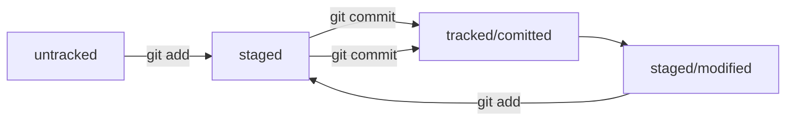

## Базовые команды в консоли

### Навигация

pwd (от англ. print working directory, «показать рабочую папку») — покажи, в какой я папке;  
ls (от англ. list directory contents, «отобразить содержимое директории») — покажи файлы и папки в текущей папке;  
ls -a — покажи также скрытые файлы и папки, названия которых начинаются с символа .;  
cd first-project (от англ. change directory, «сменить директорию») — перейди в папку first-project;  
cd first-project/html — перейди в папку html, которая находится в папке first-project;  
cd .. — перейди на уровень выше, в родительскую папку;  
cd ~ — перейди в домашнюю директорию (/Users/Username);  
cd / — перейди в корневую директорию.  

### Работа с файлами и папками
#### Создание

touch index.html (англ. touch, «коснуться») — создай файл index.html в текущей папке;  
touch index.html style.css script.js — если нужно создать сразу несколько файлов, можно напечатать их имена в одну строку через пробел;  
mkdir second-project (от англ. make directory, «создать директорию») — создай папку с именем second-project в текущей папке.  

#### Копирование и перемещение
cp file.txt ~/my-dir (от англ. copy, «копировать») — скопируй файл в другое место;  
mv file.txt ~/my-dir (от англ. move, «переместить») — перемести файл или папку в другое место.  

#### Чтение
cat file.txt (от англ. concatenate and print, «объединить и распечатать») — распечатай содержимое текстового файла file.txt.  

#### Удаление
rm about.html (от англ. remove, «удалить») — удали файл about.html;  
rmdir images (от англ. remove directory, «удалить директорию») — удали папку images;  
rm -r second-project (от англ. remove, «удалить» + recursive, «рекурсивный») — удали папку second-project и всё, что она содержит.  

#### Полезные возможности  
Команды необязательно печатать и выполнять по очереди. Можно указать их списком — разделить двумя амперсандами (&&).  
У консоли есть собственная память — буфер с несколькими последними командами. По ним можно перемещаться с помощью клавиш со стрелками вверх (↑) и вниз (↓).  
Чтобы не вводить название файла или папки полностью, можно набрать первые символы имени и дважды нажать Tab. Если файл или папка есть в текущей директории, командная строка допишет путь сама. 

 
-----
## Синхронизация с Git 

Сделать папку репозиторием — git init  
«Разгитить» папку, если что-то пошло не так, — rm -rf .git  
Проверить состояние репозитория — git status  

### Инициализация Git-репозитория требует добавления файлов.
Текстовые файлы часто используются для хранения кода, но Git может быть полезен для других типов файлов.  
Команда git status показывает статус изменений в репозитории.  
Git add запоминает текущее содержимое файла, но не сохраняет его в репозитории.  
Сохранение изменений файлов называется коммитом.  
Команда git add --all подготавливает к сохранению все файлы в репозитории.  
Команда git add . добавляет текущую папку со всеми файлами в репозиторий.  

### Команда git commit используется для создания коммита.
Ключ -m позволяет присвоить коммиту сообщение, которое поясняет изменения.  
После создания первого коммита команда git status выводит сообщение "No commits yet".  
Команда git add сохраняет файлы и их версии перед использованием git commit.  
Команда git log выводит журнал коммитов в обратном хронологическом порядке.  

----
## GitHub

В директории ~/.ssh будет создано два файла: id_ed25519 и id_ed25519.pub.  
В macOS скопируйте содержимое публичного ключа в буфер обмена с помощью команды pbcopy или распечатайте файл на экран с помощью cat ~/.ssh/id_rsa.pub.  
В Windows скопируйте содержимое ключа в буфер обмена с помощью clip или выведите содержимое файла и скопируйте его.  
Перейдите на GitHub и выберите пункт SSH and GPG keys в меню аккаунта.  
В поле Key скопируйте ваш ключ из буфера обмена.  
Нажмите на кнопку Add SSH key.  
Проверьте правильность ключа с помощью команды ssh -T git@github.com.  

Привязать удалённый репозиторий к локальному — git remote add  
Убедиться, что репозитории связаны, — git remote -v  
Отправить изменения на удалённый репозиторий — git push  

-----
## Readme

README.md - текстовый файл с описанием проекта и его особенностей.  
В README.md можно включить название проекта, его описание, используемые технологии, документацию и планы.  
Маркдаун - язык разметки, позволяющий форматировать текст и создавать заголовки, абзацы, списки и ссылки.  
Маркдаун поддерживает синтаксис многих популярных языков и инструментов.  
Файл README.md можно создать с помощью команды touch и редактировать в блокноте или другом текстовом редакторе.  
Маркдаун позволяет выделять текст курсивом, полужирным шрифтом и зачеркивать текст.  
Для оформления кода в маркдауне используются тройные кавычки и указание языка программирования.  
Оформление файла README.md помогает другим пользователям узнать больше о проекте.  

---
### пример Readme
#### This is a test project for Phyton automation 
#### My first git repository
#### File my-new-file.txt is ampty
---

#### File test.txt is not ampty
----

### File task.txt  is not ampty

It's a **3'd** file _in a directory_ 

## Хеш

Хеш - идентификатор коммита в Git. 
Хеширование - преобразование набора данных для получения их "отпечатка".  
Хеш коммита получается с помощью алгоритма SHA-1.  
Хеш состоит из цифр 0-9 и латинских букв A-F.  
Свойства хеша: если дважды получить хеш для одного набора данных, результат будет одинаковым.  
Если изменить хоть что-то в исходных данных, хеш изменится.  
Хеш - основной идентификатор коммита, позволяет узнать автора, дату и содержимое закоммиченных файлов.  
Хеши и таблицу хеш → информация о коммите Git сохраняет в служебных файлах в папке .git.  

## Исследуем лог
---
После вызова git log появляется список коммитов.  
Лог содержит описание коммита: хеш, автор, дата, сообщение.  
Команда git log --oneline выводит сокращенный лог с хешами и комментариями.  
Сокращенный лог помогает быстро найти нужный коммит среди множества.  
Уникальная длина сокращенных хешей помогает идентифицировать коммит.  

## Head
---
Файл HEAD (голова, головной) указывает на последний коммит в системе git.  
Файл HEAD находится в папке .git.  
Для проверки содержимого файла HEAD можно использовать команду cat.  
Внутри файла HEAD находится ссылка на служебный файл refs/heads/master, содержащий хеш последнего коммита.  
При работе с Git указатель HEAD используется часто, его можно заменить на слово HEAD для передачи последнего коммита.  

## Git status
---
В Git файлы могут находиться в разных состояниях: untracked, staged, modified, tracked.  
Untracked: новые файлы, не отслеживаемые Git.  
Staged: файлы после git add, в списке для коммита.  
Modified: файлы с изменениями относительно последней версии в staging.  
Tracked: файлы, отслеживаемые Git, включая фиксированные и добавленные в staging.  
Типичный жизненный цикл файла: создание, изменение, добавление в staging, коммит, изменение, добавление в staging, коммит.  

Типичные варианты вывода git status: без изменений, с найденными неотслеживаемыми файлами, с изменениями, которые не войдут в коммит, и с изменениями, которые уже попали в коммит.  
В случае изменений файла, git status может показать его состояние как "staged" и "modified".  

---
## Оформление сообщений к коммитам
---
Оформление сообщений к коммитам в Git может подчиняться определённым правилам, которые могут быть продиктованы культурой команды или техническими ограничениями.  
В выводе команды git log --oneline умещается максимум **72 первых символа сообщения**, поэтому многие правила включают пункт: «Сообщение не должно быть длиннее 72 символов».  
В этом уроке рассмотрим несколько популярных подходов к оформлению сообщений коммитов.  
Без единообразия коммитов нет и эффективной работы в Git.  
В корпоративном стиле в начале сообщения обычно указывают **Jira-ID**, а после - текст сообщения.  
**Conventional Commits** предлагает такой формат коммита: <type>: <сообщение>.  
Для сообщений на русском языке часто рекомендуют использовать инфинитивы, а для сообщений на английском рекомендуется использовать повелительное наклонение.  

[Мой GitHub](https://github.com/luboznastyk-jpg/first-project "Мой GitHub!" ) 